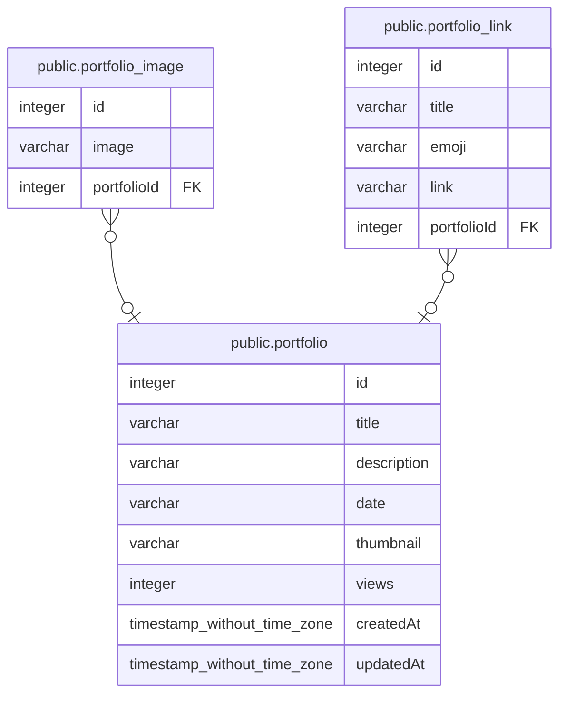

# database

## Tables

| Name | Columns | Comment | Type |
| ---- | ------- | ------- | ---- |
| [public.portfolio](public.portfolio.md) | 8 |  | BASE TABLE |
| [public.portfolio_image](public.portfolio_image.md) | 3 |  | BASE TABLE |
| [public.portfolio_link](public.portfolio_link.md) | 5 |  | BASE TABLE |

## Relations

---

> Generated by [tbls](https://github.com/k1LoW/tbls)
