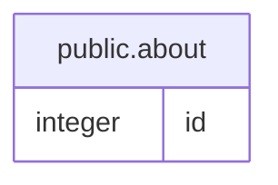

# public.about

## Description

## Columns

| Name | Type | Default | Nullable | Children | Parents | Comment |
| ---- | ---- | ------- | -------- | -------- | ------- | ------- |
| id | integer | nextval('about_id_seq'::regclass) | false |  |  |  |

## Constraints

| Name | Type | Definition |
| ---- | ---- | ---------- |
| PK_e7b581a8a74d0a2ea3aa53226ee | PRIMARY KEY | PRIMARY KEY (id) |

## Indexes

| Name | Definition |
| ---- | ---------- |
| PK_e7b581a8a74d0a2ea3aa53226ee | CREATE UNIQUE INDEX "PK_e7b581a8a74d0a2ea3aa53226ee" ON public.about USING btree (id) |

## Relations

---

> Generated by [tbls](https://github.com/k1LoW/tbls)
