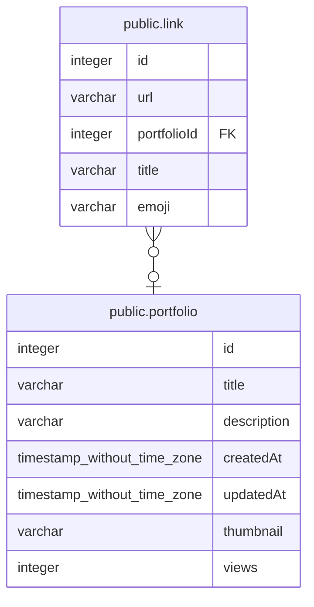

# public.link

## Description

## Columns

| Name | Type | Default | Nullable | Children | Parents | Comment |
| ---- | ---- | ------- | -------- | -------- | ------- | ------- |
| id | integer | nextval('link_id_seq'::regclass) | false |  |  |  |
| url | varchar |  | false |  |  |  |
| portfolioId | integer |  | true |  | [public.portfolio](public.portfolio.md) |  |
| title | varchar |  | false |  |  |  |
| emoji | varchar |  | false |  |  |  |

## Constraints

| Name | Type | Definition |
| ---- | ---- | ---------- |
| FK_7dc5cc10ac16923779ee246ef77 | FOREIGN KEY | FOREIGN KEY ("portfolioId") REFERENCES portfolio(id) |
| PK_26206fb7186da72fbb9eaa3fac9 | PRIMARY KEY | PRIMARY KEY (id) |

## Indexes

| Name | Definition |
| ---- | ---------- |
| PK_26206fb7186da72fbb9eaa3fac9 | CREATE UNIQUE INDEX "PK_26206fb7186da72fbb9eaa3fac9" ON public.link USING btree (id) |

## Relations

---

> Generated by [tbls](https://github.com/k1LoW/tbls)
