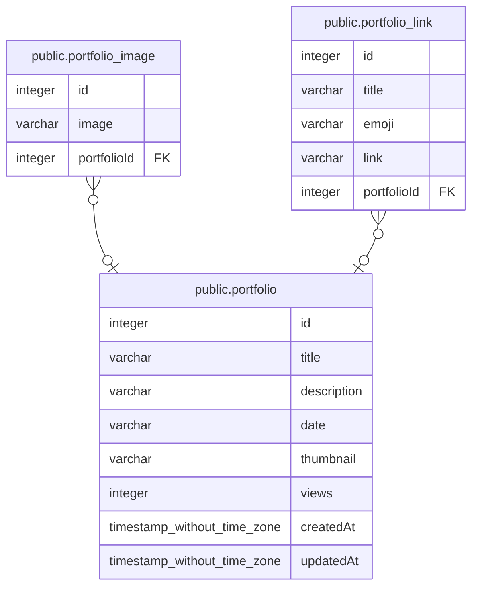

# public.portfolio

## Description

## Columns

| Name | Type | Default | Nullable | Children | Parents | Comment |
| ---- | ---- | ------- | -------- | -------- | ------- | ------- |
| id | integer | nextval('portfolio_id_seq'::regclass) | false | [public.portfolio_image](public.portfolio_image.md) [public.portfolio_link](public.portfolio_link.md) |  |  |
| title | varchar |  | false |  |  |  |
| description | varchar |  | false |  |  |  |
| date | varchar |  | false |  |  |  |
| thumbnail | varchar |  | true |  |  |  |
| views | integer | 0 | false |  |  |  |
| createdAt | timestamp without time zone | now() | false |  |  |  |
| updatedAt | timestamp without time zone | now() | false |  |  |  |

## Constraints

| Name | Type | Definition |
| ---- | ---- | ---------- |
| PK_6936bb92ca4b7cda0ff28794e48 | PRIMARY KEY | PRIMARY KEY (id) |

## Indexes

| Name | Definition |
| ---- | ---------- |
| PK_6936bb92ca4b7cda0ff28794e48 | CREATE UNIQUE INDEX "PK_6936bb92ca4b7cda0ff28794e48" ON public.portfolio USING btree (id) |

## Relations

---

> Generated by [tbls](https://github.com/k1LoW/tbls)
