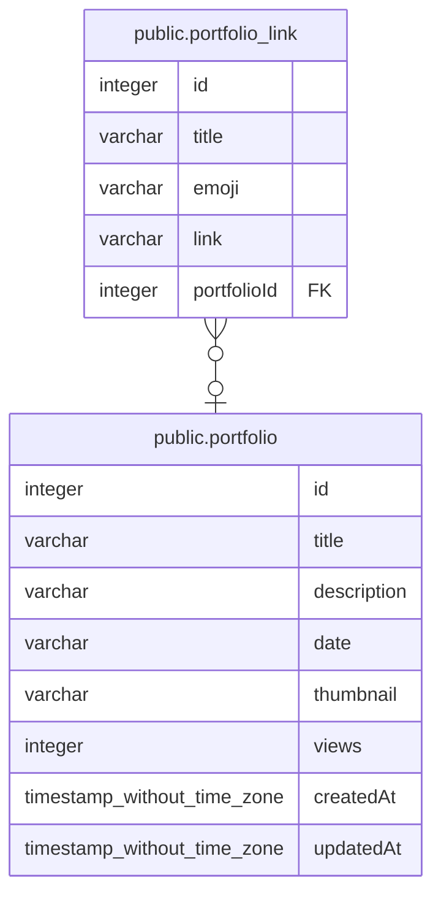

# public.portfolio_link

## Description

## Columns

| Name | Type | Default | Nullable | Children | Parents | Comment |
| ---- | ---- | ------- | -------- | -------- | ------- | ------- |
| id | integer | nextval('portfolio_link_id_seq'::regclass) | false |  |  |  |
| title | varchar |  | false |  |  |  |
| emoji | varchar |  | false |  |  |  |
| link | varchar |  | false |  |  |  |
| portfolioId | integer |  | true |  | [public.portfolio](public.portfolio.md) |  |

## Constraints

| Name | Type | Definition |
| ---- | ---- | ---------- |
| FK_b96a2226d42291eaef5c4f5e6c9 | FOREIGN KEY | FOREIGN KEY ("portfolioId") REFERENCES portfolio(id) |
| PK_7dd104f420e30b406f4a9d8c4ad | PRIMARY KEY | PRIMARY KEY (id) |

## Indexes

| Name | Definition |
| ---- | ---------- |
| PK_7dd104f420e30b406f4a9d8c4ad | CREATE UNIQUE INDEX "PK_7dd104f420e30b406f4a9d8c4ad" ON public.portfolio_link USING btree (id) |

## Relations

---

> Generated by [tbls](https://github.com/k1LoW/tbls)
